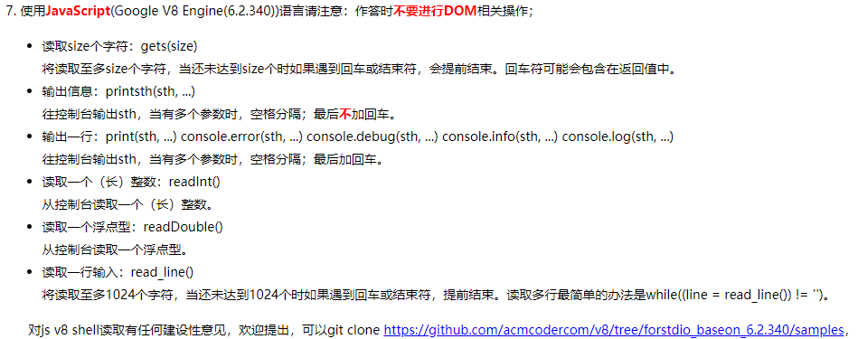

<!-- TOC -->

- [搭建javascrpt笔试/测试环境](#搭建javascrpt笔试测试环境)
    - [下面的方法介绍如何从0搭建一个可以测试JavaScript代码的环境：](#下面的方法介绍如何从0搭建一个可以测试javascript代码的环境)
    - [本文件如何下载并应用？](#本文件如何下载并应用)
- [下面的方法介绍node.js测试/笔试方法：](#下面的方法介绍nodejs测试笔试方法)
    - [下面是有关输入条件（行数）的技巧/方法：](#下面是有关输入条件行数的技巧方法)
        - [1. 单行输入](#1-单行输入)
        - [2. 多行输入](#2-多行输入)
- [下面是我遇到的一些笔试题：](#下面是我遇到的一些笔试题)

<!-- /TOC -->

### 搭建javascrpt笔试/测试环境
有些前端笔试的编程中，编程语言是没有node.js，只有JavaScript，但是要求获取输入（多行或单行）并且要输出。但是本地vscode或html中没有相关环境可以测试代码/笔试。

如下图所示：


#### 下面的方法介绍如何从0搭建一个可以测试JavaScript代码的环境：
1. 新建一个文件夹，在文件夹内，安装cnpm install readline-sync
2. 添加一个index.js文件，文件中输入以下代码：
```javascript
var __readline = require('readline-sync');
__readline.setDefaultOptions({
    prompt: ''
});
var read_line = __readline.prompt;
var print = console.log;
// 这里是要测试的js代码
```
3. 这样子，js带输入输出的本地笔试环境搭建完毕。

[参考文档](https://www.cnblogs.com/yujihang/p/7413906.html)


#### 本文件如何下载并应用？
1. 下载本project到本地
`git clone https://github.com/wuyve/Javascript-test.git`
2. 安装相关依赖包
`npm install`
3. 在`index.js`文件中输入需要测试/调试/笔试的代码，根据需要修改输入输出的变量名
4. 运行index.js
`node index.js`或`node index`


### 下面的方法介绍node.js测试/笔试方法：
搭建环境（本地要安装node）：
1. 新建一个js文件；
2. 输入nodejs代码；(推荐文档[Node.js之readline(按行读取)](http://nodejs.cn/api/readline.html))
3. 运行/测试/调试代码`node [文件名]`或`node [文件名.js]`

#### 下面是有关输入条件（行数）的技巧/方法：
##### 1. 单行输入
```javascript
var readline = require('readline');
var readlineTest = readline.createInterface({
    input: process.stdin,
    output: process.stdout
});
readlineTest.on('line', function(line){
    let str = line;  
    // 注意：这里的str不论在shell中输入的是数字还是字符串，获取到的始终是字符串，必要时要将其转换为所需要的数据类型
    console.log(str);

    // 下面是处理数据的函数
    // ...
    // 上面是处理数据的函数

    // 关闭node输入环境
    readlineTest.close();
})
```
##### 2. 多行输入
```javascript
var readline = require('readline');
var readlineTest = readline.createInterface({
    input: process.stdin,
    output: process.stdout
});
var lineCounts=3;  // 输入数据为3行
var arr=[]; // 创建数组来存储每一行的数据
var index=0; // 初始化数组的索引
readlineTest.on('line', function(line){
    // 注意：这里的line不论在shell中输入的是数字还是字符串，获取到的始终是字符串，必要时要将其转换为所需要的数据类型
    arr[index]=line;

    // 这里可以处理每一行的数据

    index++;
    if(arr.length==lineCounts){

        // 这里可以处理lineCounts行(全部)的数据

        console.log(arr[i]);
        // 关闭node输入环境
        readlineTest.close();
    }
});
readlineTest.on('close', function() {
    process.exit(0);
});
```

### 下面是我遇到的一些笔试题：
1. 去哪儿编程题1（语言：Node.js， 通过率：86%）

    由于航司规定，对单次搜索的成人和儿童数量有如下限制：
    1. 成人至少选择一个，儿童可不选
    2. 一次最多只能指定9个乘机人
    3. 一个成人最多只能携带2个儿童出行
    > 输入
        >输入成人和儿童个数
    > 输出
        >> 如果成人和儿童数量不符合规则，输出：选择不合法
        > 否则输出：
        >> 第一行：成人可选择的数量
        >> 第二行：儿童可选择的数量
例如：

输入

> 1,2

输出

> 1,2,3,4,5,6,7

> 0,1,2

```javascript
var readline = require('readline');
var readlineTest = readline.createInterface({
    input: process.stdin,
    output: process.stdout
});
readlineTest.on('line', function(line){
    let str = line;
    while(str.indexOf("，")!=-1)
    {
        str=str.replace("，",",");
    }
    let arr = str.split(',');
    let adultNum = Number(arr[0]), childrenNum = Number(arr[1]);
    if (adultNum === 0) {
        console.log('选择不合法');
    } else if (childrenNum > (adultNum * 2)) {
        console.log('选择不合法');
    } else if ((adultNum + childrenNum) > 9) {
        console.log('选择不合法');
    } else {
        let audltArr = [], childrenArr = [];
        for (let i = 1; i <= 9 - childrenNum; i++) {
            if (i * 2 >= childrenNum && i + childrenNum < 10) {
                audltArr.push(i)
            }
        }
        for (let i = 0; i <= childrenNum; i++) {
            childrenArr.push(i)
        }
        audltArr = audltArr.join(',');
        childrenArr = childrenArr.join(',');
        console.log(audltArr);
        console.log(childrenArr);
    }
    readlineTest.close();
})
```

2. 去哪儿编程题2(语言：JavaScript，通过率： AC)

    为了能让用户尽快找到低价机票，我们从服务器渠道航班数据后需要按价格进行排序，然后展示给用户。
    排序规则：
    1. 按照价格从低到高进行排序
    2. 相同价格按照 rank 值同高到低排序
    3. 排序完成后按行输出 name:rank:code:price
    输入
        > 一行包含航班数据的json字符串
    输出
        > 按行输出排序后的航班 
        > 行模板：name:rank:code:price
测试用例：
输入

> {"k3845": {"name": "name3012","price": 2715,"rank": 1},"k3489": {"name": "name2855","price": 3105,"rank": 1},"k845": {"name": "name7788","price": 1111,"rank": 1},"k77889": {"name":"name7746588","price": 1111,"rank": 2}}

输出

> name7746588:2:k77889:1111

> name7788:1:k845:1111

> name3012:1:k3845:2715

> name2855:1:k3489:3105

```javascript
var readline = require('readline');
var readlineTest = readline.createInterface({
    input: process.stdin,
    output: process.stdout
});
readlineTest.on('line', function(line){
    let jso = line;
    jso = JSON.parse(jso);
    let arr = [];
    for (let i in jso) {
        let obj = {};
        obj.code = i;
        obj.name = jso[i].name;
        obj.price = jso[i].price;
        obj.rank = jso[i].rank;
        arr.push(obj);
    }
    arr.sort((a,b) => {
        if (a.price !== b.price) {
            return a.price - b.price;
        } else {
            return b.rank - a.rank;
        }
    })
    for (let i = 0; i < arr.length; i++) {
        let result = `${arr[i].name}:${arr[i].rank}:${arr[i].code}:${arr[i].price}`
        console.log(result);
    }
    readlineTest.close();
})
```
编程题目持续更新......
